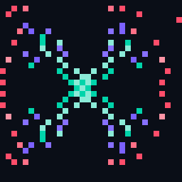

 

  

*Visionary builder · React & TypeScript · indie games & desktop apps*

---

## 🎮 Featured — [Strewn](https://github.com/brivera2005/strewn-v5-overhaul)

<table>
<tr>
<td width="120" align="center">
  
</td>
<td>

**Share the weight. Stack the loot. Deploy the minions.**

A burden-strategy game where your household becomes your command center — CYOA tutorial, family mechanics, minion deployment, loot loops, and a triage DB that never sleeps.

| | |
|---|---|
| **Hook** | Combos · streaks · rank-ups · research tree · daily objectives |
| **Play** | Portable Windows `.exe` — double-click, no terminal, no browser tab |
| **Stack** | React · TypeScript · Vite · Electron · Tauri |

> *"Today it's us. Tomorrow you'll run the registry."*

</td>
</tr>
</table>

<!-- Gameplay screenshot placeholder — drop a PNG in assets/ and uncomment:

  

-->

---

## 🛠️ Project showcase

| | Project | What it does | Stack |
|:---:|:---|:---|:---|
| 🎮 | [**strewn-v5-overhaul**](https://github.com/brivera2005/strewn-v5-overhaul) | Burden-strategy game — CYOA intro, minions, loot, triage command center | `React` `TS` `Vite` `Electron` |
| 🔍 | [**find-anything**](https://github.com/brivera2005/find-anything) | Multi-category deal search — shopping, services, tickets, vacations | `Full-stack` |
| 📺 | [**RushTV**](https://github.com/brivera2005/RushTV) | Local Windows IPTV player (Xtream Codes) | `Desktop` |
| 📱 | [**Rushy**](https://github.com/brivera2005/Rushy) | Android TV media hub for Xtream & Plex | `Android` |
| 📊 | [**clear-reports**](https://github.com/brivera2005/clear-reports) | Desktop reporting for Tebra & billing APIs | `Desktop` |
| 🌐 | [**landingpage**](https://github.com/brivera2005/landingpage) | Web landing page experiments | `Web` |

---

## 🧰 Tech I work with

  
  
  
  
  
  
  

---

## 📊 GitHub stats

  
  

  

---

## 🤝 Connect

  
  

  

---

*Building things that stick — one burden, one minion, one commit at a time.*

